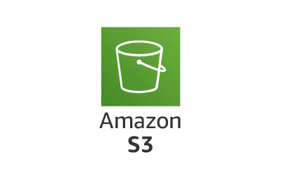

# How to download and upload files to s3

1. Create an AWS account (if not created already)
2. Go to AWS console and search USERs
3. create a new user if not created already
4. create an s3 bucket
    - generate and save Access key and secret key
5. specify policies for the bucket
    - It can be created either visually or manually by editing json
6. Add created policies to your user/bucket
7. [Download aws cli](https://docs.aws.amazon.com/cli/latest/userguide/getting-started-install.html)
8. check and verify aws version and configure it using ("**aws --version**" and "**aws configure**")
9. **pip install boto3**, boto3 helps us connect to s3 from local machine
10. setup resource and bucket to upload or download files
    - import boto3

    #### Resource
    - s3 = boto3.resource('s3')

    #### bucket
    - bucket = s3.Bucket("my-first-s3-bucket-u")

    #### uploading a file
    - bucket.upload_file(Key='synthetic_data3.csv', Filename='data/synthetic_data3.csv')

    #### Downloading a file
    - bucket.download_file(Key='synthetic_data1.csv', Filename='downloaded_data.csv')

    where:
        - Key is the name of the file in the s3 bucket
        - Filename is the path or name of the file in the local machine